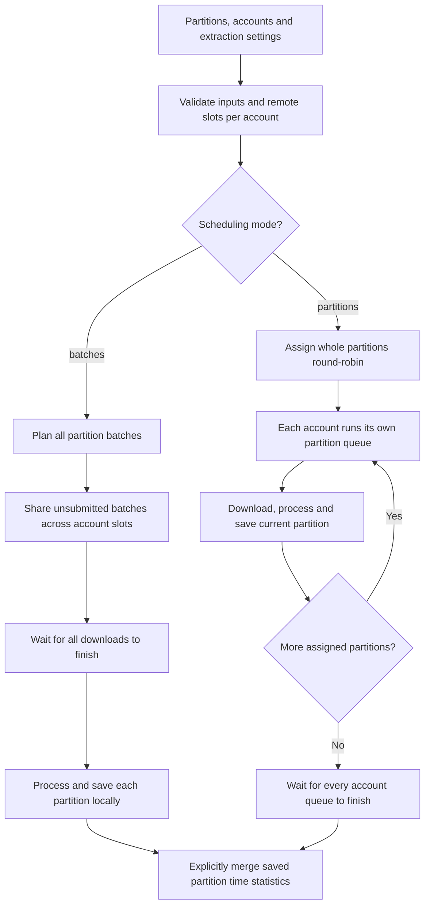
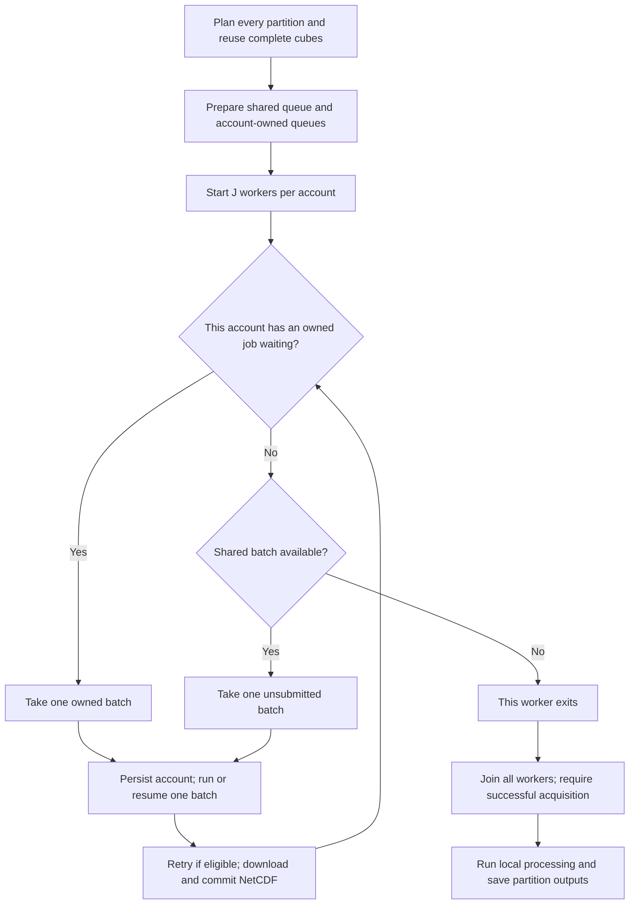
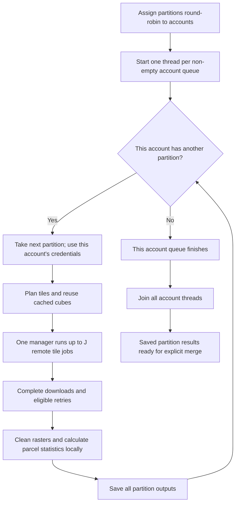

# How openEO jobs are scheduled: batches and partitions

`scheduling="batches"` assigns individual tile jobs to available account slots.
`scheduling="partitions"` assigns whole partitions to accounts, and each account
finishes its partition before starting the next one. Both modes use
`OpenEOJobManagerZonalStats` and produce the same partition output structure.

This document describes the current implementation, including where local
processing starts and how cached or previously submitted jobs affect scheduling.

## Disk cleanup and resume

Set `config["remove_nc_after_completion"] = True` to save each batch's statistics
and cleaning report as small Parquet checkpoints, then delete that batch's raw,
cleaned, final, and partial `.nc` files. Failed calculations or checkpoint writes
leave the rasters in place. This option defaults to `False` and overrides
`keep_cleaned_checkpoint` once statistics are safely saved. Reports and remote
job records are retained. Changing this flag does not invalidate existing caches.

With this flag and `scheduling="batches"`, each account slot processes and cleans
up its downloaded batch before taking another task. Local raster work is
serialized across the account threads by the existing NetCDF lock; other slots
can still download. The lock remains held until statistics and reports are
saved, NetCDF files are deleted, references to batch results are released, and
garbage collection finishes. Workers return only a batch number. Cleanup mode
also processes rasters sequentially for direct/partition callers, regardless of
`batch_workers`. Final partition assembly loads the saved statistics only after
raster processing finishes. That assembly still needs memory for the tabular
results; Python/native allocators may retain freed memory for reuse rather than
immediately reducing the process's reported RAM. This bounds accumulation of new raw
downloads by the account-slot count, although existing cached rasters and the
current batch's intermediate files still require disk space. The phase diagrams
and comparison below describe the default, where cleanup is disabled.

Set `config["resume_completed_partitions"] = True` to reuse complete partition
outputs before scheduling downloads. Both GeoParquets and the cleaning CSV must
exist and the saved parcel IDs must match. New outputs also carry a processing
signature in `satellite_partition_completion.json`. Older outputs have no such
manifest: enable this option for them only when resuming the **same processing
configuration**, parcel inputs, and partition order. The raw cache namespace is
checked, but it cannot verify every historical local cleaning/statistics option.
Set the resume option to `False` when deliberately rebuilding legacy outputs.

Completed batch checkpoints are reused even when their `.nc` files are absent.
A cleaning report alone is insufficient to recover parcel statistics: if an
unfinished legacy partition has lost its rasters, those batches are downloaded
again from their saved finished jobs and reprocessed. Recovery requires the
backend to still retain those results. Keep the account list/order unchanged
when resuming legacy jobs that do not yet record their owning username.

## Terms and controls

- **Partition:** one input GeoDataFrame in `spatial_parts`, such as a spatial
  cluster or grid group. It has its own output directory and job database.
- **Batch:** one tile plan inside a partition. It contains a group of parcels,
  a raster extent, and a target NetCDF path. Each uncached batch normally needs
  one remote openEO job; retries may create replacement jobs.
- **Account:** one unique username/password pair in `users_list`.
- **Remote slot:** capacity to process one batch remotely. Set
  `config["openeo_parallel_jobs"]` to 1 or 2 per account in this multi-user API.
- **Local worker:** a process for raster cleaning and parcel statistics. Set
  `config["batch_workers"]`; this does not increase remote account slots.

For `U` accounts and `J` remote slots per account, the configured remote capacity
is `U × J`. Actual utilization also depends on available jobs, account ownership,
downloads, retry waits, and backend scheduling. Local processing is separate.

## Comparison

| Question | `batches` (default) | `partitions` |
| --- | --- | --- |
| What does an available account take? | One unsubmitted batch from a shared queue, after its owned jobs. | Its next assigned whole partition. |
| How are accounts assigned? | Dynamically as slots take batches. | Round-robin by partition position. |
| Can several accounts process one partition? | Yes, different batches can use different accounts. | No, all jobs for that partition use its assigned account. |
| Can a free account help another account's large partition? | Yes, by taking its unsubmitted batches. | No, it only works through its own partition queue. |
| When are tiles planned? | Every partition is planned before remote workers start. | A partition is planned when its account starts that partition. |
| How many remote managers run? | One single-batch manager per occupied slot, up to `U × J`. | One manager per active account, each allowing up to `J` jobs. |
| When does local processing start? | After all remote batch workers finish successfully. | As soon as that account's current partition has all its cubes. |
| Can remote and local phases overlap? | Not between the two global phases of this invocation. | Yes, one account can be local while another downloads. |
| When does the account take more work? | After the current batch finishes downloading, including any retries. | After the partition's downloads, local processing, and output writes finish. |
| How are existing remote jobs resumed? | On their persisted owning account. | On the account implied by the same partition/account ordering. |
| Main tradeoff | Better use of accounts when partition workloads differ; later start to local processing. | Earlier partition outputs and fixed ownership; idle slots when account queues are uneven. |

## Flowchart: choosing the scheduling path



These charts show successful completion paths. The failure and resume rules
below apply to both modes.

## Workflow A: `scheduling="batches"`

Implemented by `run_shared_batches` and `_drain_batches` in
[batch_scheduler.py](../../../src/data_preparation/parcel_stats/batch_scheduler.py).

1. Create one extractor per partition, with output under `partition_<n>/`.
2. Build every partition's tile plan. Record all batch inputs for the later
   local phase and skip complete raw NetCDFs during remote scheduling.
3. Read/create each partition's `tile_jobs.parquet`. For uncached batches with
   a saved remote ID, find the owning account and enqueue them for that account.
   Place unsubmitted batches in the shared queue.
4. Start `U × J` worker threads: `J` threads per account. Each worker first tries
   its account's owned-job queue, then the shared queue. If both are empty, it exits.
5. Authenticate when a worker first needs a task. Persist `openeo_user` before
   creating a remote job. Run a manager over that batch's database row, with
   `parallel_jobs=1`; other workers provide the overall concurrency.
6. Restore a missing finished-job download or submit/resume the job, monitor it,
   perform eligible retries, download its NetCDF, and atomically commit the file.
   Then immediately take another task. Faster slots can process more batches.
7. After every remote worker succeeds, start local partition processing. At most
   `min(U, number_of_partitions)` partition threads call `run_from_batches`.
   Each extractor uses its configured `batch_workers` for local batch processes.
8. Save each partition's outputs. Return from `run_parallel_extractions`;
   the caller can then merge the saved time-statistics files.



The decision/loop runs independently in every worker. Each account's `J` workers
share its owned queue, and all accounts share the unsubmitted queue.

The shared queue is FIFO: batches enter in partition order and tile-plan order.
This is dynamic allocation of available work, not a shortest-job-first policy or
a promise of equal work per account. There is no fixed remote wave barrier;
the first free eligible worker takes the next queued batch. An existing remote
job stays with its account even if another account has spare capacity.

## Workflow B: `scheduling="partitions"`

Implemented by `run_shared_partitions` and `run_partition_extractor` in
[partition_scheduler.py](../../../src/data_preparation/parcel_stats/partition_scheduler.py).

1. Assign each partition using `(partition_number - 1) % account_count`.
   For two accounts and four partitions: account A gets P1 then P3; account B
   gets P2 then P4.
2. Start one thread per non-empty account queue. Accounts run concurrently;
   each account loops through its own partition list sequentially.
3. For the current partition, construct an extractor with that account's
   credentials and call `run()`.
4. Plan that partition's tiles, reuse cached cubes, and use one manager to
   submit/monitor up to `J` remote jobs. The manager replenishes available
   remote slots while uncached tile jobs remain.
5. Once the partition's downloads succeed, run its local cleaning, indices,
   statistics, reshaping, and output writes using `batch_workers`.
6. Only after all of step 5 returns does that account start its next partition.
   Its remote capacity is unused by this invocation while it is in the local phase.
7. Wait for all account queues to finish. The caller can then merge saved results.



Each account has its own copy of this loop. There is no cross-account transfer
of partitions or their unsubmitted jobs when one account finishes early.

## Example: one large partition and one small partition

Assume two accounts, two remote slots each, P1 containing 12 uncached batches,
and P2 containing 2. Every batch takes one equal time unit, including download.
Ignore planning, polling, authentication, retries, and local-processing duration.
This is an illustration of allocation, not a measured runtime prediction.

| Remote time interval | `partitions`: account A | `partitions`: account B | `batches`: four shared slots |
| --- | --- | --- | --- |
| 0–1 | P1 batches 1–2 | P2 batches 1–2 | P1 batches 1–4 |
| 1–2 | P1 batches 3–4 | No more remote work | P1 batches 5–8 |
| 2–3 | P1 batches 5–6 | No more remote work | P1 batches 9–12 |
| 3–4 | P1 batches 7–8 | No more remote work | P2 batches 1–2; two slots idle |
| 4–5 | P1 batches 9–10 | No more remote work | Remote phase complete |
| 5–6 | P1 batches 11–12 | No more remote work | Remote phase complete |

Under these assumptions, remote work takes **6 units with partitions** and
**4 units with batches**. In partitions mode, account B can start local work on
P2 at time 1. In batches mode, local work starts after time 4. Actual end-to-end
runtime depends on local work too; shared scheduling is not always faster overall.

The table groups equal-duration completions for readability. The batch scheduler
does not implement these rows as synchronized waves. Account identities for the
final P2 jobs depend on which workers reach the shared queue first.

## Local concurrency, failures, and resume

Both schedulers ultimately use the same local engine and cache files:

```text
output_dir/
  partition_1/
    monthly_cubes/<signature>/tile_jobs.parquet
    monthly_cubes/<signature>/batch_00001_monthly.nc
    satellite_parcel_time_stats.geoparquet
    satellite_parcel_annual_stats.geoparquet
    satellite_pixel_cleaning_report.csv
  partition_2/
    ...
```

`LOCAL_RASTER_LOCK` serializes local raster work inside each process. Setting
`batch_workers=1` therefore does not mean that each concurrent partition thread
cleans rasters simultaneously. With multiple batch workers, each active partition
can create its own process pool, bounded by its batch count. More remote slots
do not directly create more local processes.

Both paths use the manager's retry/download helpers. In batches mode, a task's
worker stays occupied through retry waits and download. If acquisition raises,
the shared scheduler does not enter its local phase. In partitions mode, failure
stops that account's queue before its next partition. Other account threads may
finish work already in progress; raising an exception is not a global remote-job
cancellation mechanism. Complete cubes remain available for restart.

Preserve partition ordering, configuration, caches, and account ownership when
resuming. Shared scheduling stores `openeo_user` per submitted batch. Rows without
an owner fall back to the original round-robin account order. Partition scheduling
selects credentials from partition/account order and does not route each batch
using its saved owner. Consequently, switching a partially completed shared run
to partition mode can select the wrong account for existing remote IDs. Prefer
resuming in the same mode and with the same partition/account ordering.

`load_openeo_users_from_db()` reads accounts from PostgreSQL and sorts them by
case-insensitive username. When migrating a legacy run or using partition mode,
restore the original account order explicitly; database insertion order is not
an ownership record. See [database account setup and restart ordering](CREDENTIALS.md).

## Calling the scheduler

Pass `scheduling` as a keyword argument to `run_parallel_extractions`, separately
from the extraction configuration:

```python
from data_preparation.parcel_stats.multiuser import (
    run_parallel_extractions,
)

# spatial_parts, users_list and extraction_config are prepared beforehand.
extraction_config["openeo_parallel_jobs"] = 2  # remote slots per account
extraction_config["batch_workers"] = 1        # local workers per partition

run_parallel_extractions(
    spatial_parts=spatial_parts,
    users_list=users_list,
    config=extraction_config,
    scheduling="batches",  # change to "partitions" for whole-partition queues
)
```

Use `batches` when spreading a large partition's unsubmitted jobs across accounts
is valuable. Use `partitions` when fixed partition ownership or producing each
partition's output earlier is more important. Neither mode changes tile geometry,
pixel processing, or the need for an explicit final merge.

See [the complete data-preparation workflow](WORKFLOW.md) for the processing
stages and output checks, [the multi-user guide](MULTIUSER_IMPLEMENTATION_GUIDE.md)
for configuration, and [multiuser.py](../../../src/data_preparation/parcel_stats/multiuser.py)
for validation and dispatch.
