# Detailed openEO data preparation workflow

This guide follows the implementation in `data_preparation`: parcel
polygons and Sentinel selections enter the pipeline; dated parcel features,
run-wide summaries, cleaning audits, and restart checkpoints leave it. The remote
openEO backend prepares physical-band rasters. Local code cleans those bands,
calculates indices, masks parcels, and writes the statistics.

For limited disk space, enable `remove_nc_after_completion=True`: each batch's
NetCDF files are removed only after durable statistics and audit checkpoints
are saved. `resume_completed_partitions=True` also reuses completed partition
outputs. See [cleanup and resume](SCHEDULING.md#disk-cleanup-and-resume) for the
streaming behavior and requirements for resuming older runs.

## 1. Entry points and responsibilities

| Entry point | Work performed |
| --- | --- |
| `OpenEOZonalStats.run()` | Acquire parcel-batch cubes, then process and save them locally. |
| `OpenEOJobManagerZonalStats.run()` | Use the same local engine with tile planning, persistent remote job state, and retries. |
| `OpenEOZonalStats.run_from_batches(batches)` | Process already acquired `(batch_number, parcels, netcdf_path)` tuples and save results. |
| `run_parallel_extractions(parts, users, config)` | Schedule partition tile jobs across accounts and persist each partition's results. Returns `None`. |
| `merge_and_save_results(...)` | Load saved partition time-statistics files, merge them, and return `(GeoDataFrame, output_path)`. |

Use the current `OpenEOZonalStats` and `OpenEOJobManagerZonalStats` class names.
There are no historical class aliases in the public package.

All paths below are relative to `src/data_preparation/`:

| Module | Responsibility and principal methods |
| --- | --- |
| [parcel_stats/openeo.py](../../../src/data_preparation/parcel_stats/openeo.py) | `run`, `run_from_batches`: acquire, aggregate, reshape, persist. |
| [parcel_stats/core/base.py](../../../src/data_preparation/parcel_stats/core/base.py) | Constructor, loggers, `_run_batch_statistics`, process workers. |
| [parcel_stats/core/configuration.py](../../../src/data_preparation/parcel_stats/core/configuration.py) | Validation, required/output variables, intervals, raw-cache signature. |
| [parcel_stats/core/parcel_batches.py](../../../src/data_preparation/parcel_stats/core/parcel_batches.py) | `_prepare_parcels`, `_iter_spatial_batches`. |
| [sources/openeo/cubes.py](../../../src/data_preparation/sources/openeo/cubes.py) | Authentication, process graphs, temporal aggregation, base job waves and downloads. |
| [parcel_stats/job_manager.py](../../../src/data_preparation/parcel_stats/job_manager.py) | Tile extents, job database, concurrency, retries, download recovery. |
| [parcel_stats/core/streamed_raster.py](../../../src/data_preparation/parcel_stats/core/streamed_raster.py) | Disk-backed physical and final checkpoints, layer/strip/window processing. |
| [parcel_stats/core/raster_cleaning.py](../../../src/data_preparation/parcel_stats/core/raster_cleaning.py) | IQR filtering, temporal filling, spatial means, interpolation, audit counts. |
| [parcel_stats/core/parcel_statistics/](../../../src/data_preparation/parcel_stats/core/parcel_statistics) | Cube validation, index formulas, parcel masks, reducers, geometry metrics, streamed checkpointing, and wide output. |
| [parcel_stats/multiuser.py](../../../src/data_preparation/parcel_stats/multiuser.py) | Accounts, partitions, scheduler selection, saved-result merging. |
| [parcel_stats/batch_scheduler.py](../../../src/data_preparation/parcel_stats/batch_scheduler.py) | Default shared batch queue and persisted account ownership. |
| [parcel_stats/partition_scheduler.py](../../../src/data_preparation/parcel_stats/partition_scheduler.py) | Optional sequential partition queue per account. |
| [features/temporal.py](../../../src/data_preparation/features/temporal.py) | Summarize each source's dated parcel medians. |

## 2. End-to-end flow

```mermaid
flowchart TD
    A[Parcel polygons, dates, sensor selections and settings] --> B[Validate configuration and repair geometries]
    B --> C[Plan parcel batches or buffered tiles]
    C --> D{Complete raw cube cached?}
    D -->|No| E[Authenticate and build physical-band process graph]
    E --> F[Execute remote jobs and download NetCDF atomically]
    D -->|Yes| G[Validate raw cube metadata and time coordinates]
    F --> G
    G --> H{Final checkpoint and audit reusable?}
    H -->|Yes| N[Read parcel windows from final checkpoint]
    H -->|No| I{Physical checkpoint and audit reusable?}
    I -->|No| J[Read each physical band and time slice; optional IQR filtering]
    J --> K[Optional temporal fill, spatial mean passes and interpolation]
    K --> L[Commit physical checkpoint and cleaning audit]
    I -->|Yes| M[Calculate pixel indices and their provenance]
    L --> M
    M --> O[Commit final checkpoint; optionally remove physical checkpoint]
    O --> N
    N --> P[Reduce valid parcel pixels for each reporting period]
    P --> Q[Add geometry, quality and derived statistics]
    Q --> R[Pivot dated features; attach parcel attributes and geometry]
    R --> S[Write time statistics, annual summary and cleaning report]
    S --> T[For multi-user runs: explicitly merge partition time statistics]
```



The diagram describes one extraction partition. With default multi-user
scheduling, all partitions finish remote acquisition before local partition
processing begins.

## 3. Prepare inputs and resolve configuration

Supply a `GeoDataFrame`, `start_date`, `end_date`, `output_dir`, and projected
`working_epsg`. Choose an identifier with `parcel_id_field` (default `parcel_id`).
The constructor performs the following work before remote submission:

1. Validate dates, projected CRS, selected bands/indices, temporal settings,
   reducers, cleaning settings, interpolation distances, and worker counts.
2. Copy parcels and preserve their source attributes. If the identifier column
   is absent, create it from stringified index values; identifiers are converted
   to strings. Supply meaningful non-null IDs upstream.
3. Repair geometries using `make_valid`, extract polygonal components, and
   remove null, empty, and non-polygonal results. Reject an empty result or
   duplicated IDs after conversion and filtering.
4. Store normalized parcels in EPSG:4326. Use `working_epsg` for metric planning
   and final geometry; align parcel masks to the actual raster CRS locally.
5. Resolve physical source bands independently from requested output variables.
   For example, NDVI requires B08 and B04 even if neither is an output band.
6. Construct reporting intervals anchored at `start_date`, with an exclusive
   upper boundary and labels equal to interval starts. `1M` means monthly steps
   from that date; `15D`, `2M`, `3M`, and `1Y` are also supported.

Default S2 output bands are B02, B03, B04, B05, and B08; indices and S1 outputs
are disabled unless selected. At least one band or index must be requested.
`mean` is always included in spatial statistics. Request `median` explicitly
for useful annual-summary features. IQR removal and filling default to disabled.

## 4. Plan spatial work

Multi-user planning has two levels: create the outer `spatial_parts`, then let
each partition's job manager plan its remote raster batches. A partition can
contain several jobs. See [parcel grouping](PARCEL_GROUPING.md) for both methods
and [worked examples](PARCEL_GROUPING.md#worked-examples-with-the-same-six-parcels)
showing actual memberships and raster dimensions.

### 4.1 Create the outer partitions

Choose how to build the GeoDataFrames passed to `run_parallel_extractions`:

- **Buffer clusters:** `spatial_clustering_using_buffer` buffers each parcel by
  half of `min_cluster_distance_in_m`, unions the buffers into polygon components,
  and assigns cluster labels back to the original parcels. Create `spatial_parts`
  by grouping on those labels. Connectivity can chain across many parcels, so the
  distance threshold does not limit a cluster's width or height. Reject missing
  labels before `groupby`, which would otherwise omit those parcels.
- **Grid partitions:** `split_geodataframe_by_grid` assigns whole parcels to
  outer cells by their **centroids**. Supply `rows` and `cols`, or
  `partition_count`. Empty cells are omitted; parcel counts need not be balanced.
  Use a projected input CRS and a unique index for reliable assignment.

Alternatively, supply one partition containing all parcels and let the manager
create the remote batches. Each parcel must appear in exactly one partition.
These helpers organize whole geometries; they do not cut parcels at boundaries.

The Neuro fill notebook currently reuses existing `cluster` labels or generates
them with a 20,000 m clustering threshold. It creates one partition per cluster
and selects fitted extents with a 20,000 m maximum buffered dimension. These two
20 km settings have independent meanings; a connected cluster can exceed the
remote size limit and require several jobs.

### 4.2 Plan remote batches within each partition

The manager supports two extent strategies, independently of how outer partitions
were created:

| Manager setting | Parcel assignment | Requested raster extent |
| --- | --- | --- |
| `fit_tiles_to_parcels=False` (default) | Representative point selects one core tile | Core tile bounds plus buffer |
| `fit_tiles_to_parcels=True` | Whole-parcel groups split only above the size limit | Group bounds plus buffer |

Regular-grid planning resolves points on shared edges deterministically, skips
empty tiles, and checks that each buffered tile covers its assigned whole parcels.
A coverage failure writes `uncovered_buffered_tile_parcels.csv` and stops before
submission. Parcel counts do not determine tile sizes; dense tiles can contain
many more parcels than their neighbors.

Fitted planning begins with all parcels in the partition. It splits oversized
groups along the longer spatial dimension using parcel bounding-box centers,
with a median fallback when all centers fall on one side of the midpoint. It
repeats until every requested extent fits. An individual parcel whose bounds plus
buffer exceed the limit raises an error, because the planner cannot cut it.

In both manager modes, one non-empty planned batch becomes one remote job.
Each parcel has one owner even when buffered rectangular download extents overlap.

The base `OpenEOZonalStats` path uses a separate batching strategy: group projected
parcel centroids into 50 km cells, sort spatially, then split each cell into
batches of at most 5,000 parcels. It sends batch geometries through
`filter_spatial`; it does not use the manager's fitted/regular tile setting.

### 4.3 Interpret tile sizes and buffers

For regular tiles, `tile_size_metres` is the **unbuffered core** size. For fitted
extents, it is the **maximum requested width and height including the buffer**.
The manager defaults are 50,000 m and a 500 m buffer; the Neuro notebook overrides
the size to 20,000 m and calculates its buffer from the parcel geometries.

For example, with `tile_size_metres=20_000` and `tile_buffer_metres=1_400`:

- A full regular core tile requests a 22,800 m-wide raster after buffering.
- A fitted group spanning 18,000 m needs 20,800 m after buffering, so it must split.

`compute_tile_buffer_metres` chooses a conservative coverage margin from parcel
geometry. This tile buffer is separate from the buffer used to connect clusters.
`compute_tile_width` compares regular-grid candidates using the actual partitions,
selecting the largest candidate with enough occupied tiles per partition, or the
smallest candidate if none meet the target. It does not select a fitted-extent
limit or guarantee backend memory usage.

### 4.4 Schedule and preserve the plan

The base extractor uses remote waves of at most `batch_workers` and the same
setting for local processes. The manager uses `openeo_parallel_jobs` for remote
slots and `batch_workers` for local processing. In default multi-user batch
scheduling, remote slots belong to accounts and draw from all partitions;
partition count does not have to equal account count. See [scheduling](SCHEDULING.md).

Keep partition membership/order and planning settings stable when resuming.
Fitted and regular tiles use separate cache signatures. When deliberately
regrouping parcels, use a new run/output directory so completed partition outputs
are not mistaken for results of the new grouping.

## 5. Acquire Sentinel rasters remotely

Reuse an existing complete `batch_XXXXX_monthly.nc` first. For missing cubes,
connect to the configured CDSE endpoint. With both `openeo_username` and
`openeo_password`, use the configured OIDC password flow; otherwise use the
client's cached/interactive OIDC flow. Credentials are not written to job tables.

### Sentinel-2 branch

1. Load `SENTINEL2_L2A` with required physical bands plus SCL, the temporal extent,
   and configured maximum scene cloud cover (70).
2. Restrict spatial extent using batch polygons or the manager's rectangle.
3. Resample reflectance bilinearly to 10 m in `working_epsg`, then scale by 0.0001.
4. Align SCL to reflectance with nearest-neighbor resampling.
5. Mask SCL classes 0, 1, 3, 8, 9, 10, and 11. Expand cloud-related classes
   3, 8, 9, 10, and 11 with a 3x3 kernel before masking cloud edges.
6. Retain physical source bands and apply the selected temporal behavior.

### Sentinel-1 branch

1. Load `SENTINEL1_GRD` with required VV/VH polarizations. Apply the requested
   ascending/descending filter, or no direction filter for `BOTH`.
2. Calculate `sigma0-ellipsoid` backscatter with `COPERNICUS_30` and
   `local_incidence_angle=False`. Values remain linear power.
3. Apply temporal behavior, then align radar to the S2 grid when S2 is present.
   For S1-only runs, resample directly to 10 m in `working_epsg`.
4. Merge the two sensor cubes when both are enabled. Indices are computed locally.

### Temporal behavior

| Setting | Remote raster | Local statistic sample |
| --- | --- | --- |
| `mean`, `median`, `min`, `max`, `sum` | One composite per reporting period. For `1M` starting on a month boundary, use the native monthly operator; otherwise explicit intervals. | Valid parcel pixels in each composite. |
| `"none"` or `None` | Retain acquisition timestamps. | Pool valid pixel observations from all acquisitions within the reporting interval, separately per output variable. |

For retained acquisitions, `[1, 2, 3, 4]` from one image and `[10]` from another
give a pooled mean of 4 and median of 3. Every valid observation has equal weight.
Indices are calculated at each pixel/acquisition before pooling. With composites,
indices use composite physical bands; an index of band medians is generally
different from a median of acquisition-level indices.

Local intervals include the configured final calendar day. The current remote
extent helper adds one day to `end_date` only for retained acquisitions; composite
runs pass `end_date` unchanged. Thus the code does not apply the same explicit
final-day extension in both modes. This is a current implementation limitation.

### Job completion and downloads

The base path creates bounded waves, waits for jobs, downloads to `.partial.nc`,
and renames on success. The manager persists `tile_jobs.parquet`, monitors slots,
and uses the same partial-file completion rule. Default polling is 30 seconds;
the manager allows three retries with a 60-second cooldown.

Retryable statuses are `error`, `start_failed`, and `queued_for_start_failed`.
Start failures with a saved ID retry that existing job; other eligible failures
create replacements. Retry counts and failed job IDs persist across restarts.
Missing downloads for finished jobs are restored from their saved remote IDs.
If expected cubes remain missing, extraction raises with job/database details.

## 6. Validate and clean each cube locally

`_run_batch_statistics` processes each acquired batch. `_calculate_streamed_statistics`
opens the raw NetCDF and validates physical bands, temporal/x/y dimensions, CRS,
and timestamps before reusing or creating checkpoints. Acquisition timestamps
are sorted stably and must lie inside the configured intervals. Composite period
labels must be unique and recognized. Missing raster CRS is an error.

The cleaning order is:

```text
physical bands -> IQR filtering -> temporal filling -> spatial means
               -> final interpolation -> pixel indices -> parcel statistics
```

| Stage | Behavior |
| --- | --- |
| IQR, when enabled | Compute quantiles across the complete raster for one physical band/time slice. Remove values outside `Qlow - multiplier * IQR` and `Qhigh + multiplier * IQR`. Skip filtering below `iqr_min_valid_pixels` (default 20). |
| Fill eligibility | Use the full layer's post-IQR observed fraction. Default threshold is 0.20; a layer below it cannot be filled or supply temporal observations. |
| Temporal fill | Work at the same spatial pixel. Default `past_only` uses the nearest earlier observation. `bidirectional` averages closest earlier/later observations, or uses the available side. Optional odd windows count time steps, not days. Filled values do not extend the temporal search. |
| Spatial means | Apply configured neighborhoods sequentially: default 3x3 then 5x5; optional 7x7 and 9x9. Earlier passes can supply later passes. |
| Final interpolation | Fill eligible remaining gaps using `nearest`, `idw`, or `kriging`. IDW and kriging require their corresponding distance settings. Remaining nulls are retained. |

These are raster-level operations before parcel masking. Spatial neighbors can
cross parcel boundaries. Temporal filling can cross reporting-period boundaries.
With `temporal_reducer="none"`, disable both IQR removal and filling to measure
all observed valid pixels without outlier exclusion or imputation.

The engine reads one physical band/time layer at a time, fills temporal strips
containing all dates, then processes complete spatial layers. Parcel reduction
reads one parcel window, output variable, and reporting period at a time. Exact
medians/percentiles still need that sample pool in memory. Within a process,
`LOCAL_RASTER_LOCK` serializes raster access; extra batch processes have separate
memory requirements. The streamed design reduces RAM use by writing intermediate
NetCDF data to disk.

## 7. Calculate indices and preserve provenance

`_stream_output_indices` creates requested output bands and indices from cleaned
physical bands, one time slice/output at a time. Extra dependency bands do not
become standalone outputs unless requested. Existing indices in raw cubes are
ignored and recalculated.

Examples: `NDVI = (B08 - B04) / (B08 + B04)`, `NDWI = (B03 - B08) / (B03 + B08)`,
`R = VV / VH`, and `RVI = 4 * VH / (VV + VH)`. Safe division leaves invalid
denominators as nulls. See `_calculate_optical_index` and
`_calculate_local_sentinel1_index` for all formulas.

Both physical and final checkpoints have dimensions `(period, variable, y, x)`:

| Array | Meaning |
| --- | --- |
| `cleaned` (`float32`) | Final values for that checkpoint's bands or indices. |
| `observed_mask` (`uint8`) | A finite value available from post-IQR observations alone. |
| `temporal_filled_mask` (`uint8`) | A value made available at the temporal stage. |

Index masks are derived by evaluating the index from observation-only and
post-temporal source states. A finite final value that is neither observed nor
temporal is attributed to spatial filling, including final interpolation.

## 8. Aggregate parcel pixels and reshape features

1. Reproject each parcel to the raster CRS and crop to its pixel bounding window.
2. Rasterize with `all_touched=True`: boundary-intersecting cells participate;
   there is no fractional-area weighting.
3. Reduce finite values for each variable/reporting period. Supported statistics
   include mean, median, sample SD (`ddof=1`), min, max, range, and p10/p25/p75/p90.
   Empty samples produce null statistics; SD requires at least two observations.
4. Record static counts, quality flags, filling provenance, and rasterized area.
   Parcels below `minimum_parcel_pixels` (default 3) remain in the results.
5. Add projected geometry area, compactness, perimeter/area ratio, shape index,
   elongation, and shape complexity. Add derived range, variance, coefficient of
   variation, IQR, Bowley skewness, and p90-p10 spread where source statistics exist.
6. Verify one row per parcel/period and that static metrics are consistent across
   periods. Pivot temporal columns to `<variable>_<statistic>__YYYYMMDD`.
7. Pad missing reporting-period feature columns with nulls. Attach parcel
   attributes and geometry once, rejecting collisions with generated columns,
   and write geometry in `working_epsg`.

The quality denominator is based on the stored cube:

```text
expected_pixel_count = intersected spatial cells × output variables × stored time steps
data_reliability_score = observed_count / expected_pixel_count
temporal_filled_ratio = temporal_filled_pixel_count / expected_pixel_count
spatial_filled_ratio = spatial_filled_pixel_count / expected_pixel_count
```

Stored time steps mean composites in reduced mode or acquisition timestamps in
retained-acquisition mode. A merged multisensor time axis can include timestamps
without observations for one sensor. Reliability is observed coverage of those
slots, not a classification confidence or an accuracy estimate. A zero denominator
produces null ratios. `intersected_pixel_count` counts spatial cells only.

## 9. Persist results

Paths are relative to the extractor's `output_dir`:

| Artifact | Contents |
| --- | --- |
| `satellite_parcel_time_stats.geoparquet` | One row per retained parcel; original attributes, static metrics, dated features, projected geometry. Also returned by `run()`. |
| `satellite_parcel_annual_stats.geoparquet` | Static fields plus mean/min/max/population SD of each selected source's dated parcel medians. |
| `satellite_pixel_cleaning_report.csv` | Physical-band raster audit by batch/time/variable: IQR and per-fill-stage null/fill counts. |
| `satellite_zonal_stats.log` | Configuration and orchestration. |
| `satellite_source.log` | Acquisition, remote jobs and downloads. |
| `satellite_raster_filling.log` | Filling stage progress. |
| `satellite_parcel_statistics.log` | Cube validation, checkpoints and parcel reduction. |
| `monthly_cubes/<signature>/batch_XXXXX_monthly.nc` | Complete raw physical-band cube; filename also used for non-monthly/acquisition runs. |
| `.../batch_XXXXX_monthly_cleaned.nc` | Intermediate cleaned physical bands and provenance; normally removed after final checkpoint commit. |
| `.../batch_XXXXX_monthly_cleaning_report.parquet` | Persisted per-batch raster cleaning audit. |
| `.../batch_XXXXX_monthly_final.nc` | Requested bands/indices and provenance used for parcel statistics. |
| `.../tile_jobs.parquet`, `.../job_manager/` | Manager job state and diagnostic artifacts. |

Workers use `.worker-<pid>.log` suffixes. The annual file is an aggregation of
per-period parcel medians over the **entire run**, even for multi-year date ranges;
it does not split by calendar year. Its names are, for example,
`NDVI_median_annual_mean` and `NDVI_median_annual_std` (`ddof=0`). All dated columns
are removed from that file. Include spatial `median`: with no median columns,
the current reducer can emit null annual features.

Writes occur in this order: time statistics, annual statistics, cleaning CSV.
The annual file and raster checkpoints use temporary files plus replacement;
the three final outputs are not committed as one transaction. Confirm all three
outputs belong to the completed run before downstream analysis.

## 10. Multi-user orchestration

See [batches versus partitions: scheduling workflows and flowcharts](SCHEDULING.md)
for account assignment, slot reuse, phase boundaries, and a worked example.

1. Load unique account credentials using `load_openeo_users_from_db` and prepare
   disjoint grid or cluster partitions. Partition count need not equal user count.
   See [database account setup](CREDENTIALS.md) for the required environment,
   table columns, validation, and deterministic username ordering.
2. Call `run_parallel_extractions(..., scheduling="batches")`, the default.
   The scheduler constructs one extractor and tile plan per partition under
   `output_dir/partition_<n>/`.
3. Skip cached cubes. Pin submitted jobs to their saved `openeo_user`; put new
   jobs into the shared queue. Accounts take owned jobs before unsubmitted work.
   Older job tables without usernames infer ownership from original account order.
   Restore that original order explicitly if migrating from the environment loader.
4. Run up to `openeo_parallel_jobs` slots per account (the multi-user API accepts
   1 or 2). Database row updates are locked so concurrent jobs preserve each
   other's progress. Passwords are not persisted in local job files; they are
   retrieved from the separate PostgreSQL account table.
5. After remote downloads complete, run local partition processing with at most
   `min(account_count, partition_count)` active partition threads. Each partition
   uses its configured local `batch_workers`; same-process raster work is locked.
6. Call `merge_and_save_results` explicitly. It aligns partition columns, merges
   the saved time-statistics files, optionally reprojects, and writes the root
   `satellite_parcel_time_stats.geoparquet`.

Supplying `parcel_id_column` to the merge drops duplicate IDs, keeping the first.
Validate partitions are disjoint and all expected IDs are present; the merge
prints counts but does not enforce full input coverage. It does not merge annual
files or cleaning audits. Use a run-specific output directory so discovery does
not include results from unrelated partitions.

`scheduling="partitions"` instead runs sequential partition queues assigned
round-robin across accounts. See the [calling example](CALLING_EXAMPLE.md) and
[multi-user guide](MULTIUSER_IMPLEMENTATION_GUIDE.md).

## 11. Resume and failure handling

| Available state or failure | Next action / behavior |
| --- | --- |
| Complete raw cube | Skip remote computation and validate locally. Raw file existence is the acquisition completion marker. |
| Compatible final checkpoint plus audit | Skip cleaning and index calculation; recompute parcel statistics from windows. Raw metadata is still required. |
| Compatible physical checkpoint plus audit | Skip physical cleaning; rebuild indices/final checkpoint. |
| Raw only | Rebuild physical and final checkpoints locally. |
| `.partial.nc` only | Incomplete output; it is not a reusable completed cube. |
| Changed local signature | Rebuild incompatible local checkpoints. Keep raw cubes when their namespace still matches. |
| Finished manager job, missing raw cube | Restore the download by saved job ID and owning account. If unavailable, fail with diagnostic details. |
| Job retries exhausted | Inspect `tile_jobs.parquet` and `job_manager/`; resolve the backend/configuration cause before retrying. |
| Missing bands, invalid times, or absent CRS | Inspect the raw cube/configuration; do not force assumed alignment. |
| Incomplete filling | Read the audit's `final_null_count` and `has_remaining_nulls`; null statistics can be valid outputs. |
| Memory pressure | Reduce local workers and spatial extent. Keep cache files; restart the notebook kernel to release retained arrays. |

The raw-cache hash includes dates, sensor/temporal options, CRS, parcel IDs and
geometries, and several cleaning options. Manager namespaces also include tile
strategy, size and buffer. Changing some cleaning options therefore changes the
raw namespace too. Temporal/spatial window sequences and kriging variogram
settings are checked in the separate local cleaning signature. Do not assume
every cleaning change reuses the same download.

Set `keep_cleaned_checkpoint=True` to retain physical checkpoints. Final
checkpoints and their audit are normally sufficient for local restart; preserve
raw cubes as well because metadata validation precedes checkpoint reuse.

## 12. Minimal single-account example and completion checks

This example uses the base batch API and requires the repository's acquisition
dependencies plus an authenticated CDSE account. It starts remote jobs when run.

```python
from pathlib import Path
import geopandas as gpd
from data_preparation.parcel_stats import (
    OpenEOZonalStats,
    estimate_utm_epsg_from_parcels,
)

def main():
    parcels = gpd.read_file("parcels.gpkg")
    extractor = OpenEOZonalStats(
        parcels=parcels,
        parcel_id_field="parcel_id",
        start_date="2024-01-01",
        end_date="2024-12-31",
        output_dir=Path("outputs/openeo_parcel_stats"),
        working_epsg=estimate_utm_epsg_from_parcels(parcels),
        sentinel2_bands=["B04", "B08"],
        sentinel2_indices=["NDVI"],
        temporal_period="1M",
        temporal_reducer="none",
        spatial_statistics=["mean", "median", "sd", "min", "max"],
        remove_outliers=False,
        fill_nulls=False,
        batch_workers=1,
    )
    result = extractor.run()
    assert result["parcel_id"].is_unique
    assert set(result["parcel_id"]) == set(extractor.parcels["parcel_id"])
    assert result.crs.to_epsg() == extractor.working_epsg
    return result

if __name__ == "__main__":
    main()
```

Before passing outputs to feature engineering or classification, verify parcel
coverage and CRS, expected dated columns, useful median-summary columns, all
three persisted outputs, and cleaning/reliability metrics. For multi-user runs,
perform these checks after the explicit merge and review partition audits.
