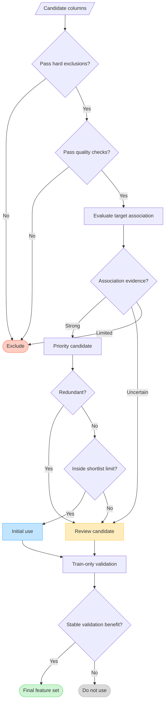

# Ordered Feature-Selection Criteria

The ordered selection criteria define how the EDA pipeline creates an initial feature proposal for machine-learning experiments.
They are applied sequentially as decision gates, rather than being combined into one arbitrary score.

The generated `feature_selection_proposal.csv` assigns every screened feature one of these actions:

- `use`: recommended for the initial ML experiment;
- `review`: potentially useful, but redundant, statistically uncertain, or outside the configured shortlist; or
- `exclude`: unsuitable because of a hard exclusion, poor data quality, or limited evidence.

## Workflow graph



Download the rendered [PNG workflow](FEATURE_SELECTION_WORKFLOW.png) or use the
[standalone Mermaid source](FEATURE_SELECTION_WORKFLOW.mmd) to regenerate it.

The `exclude` branches end the automated EDA screening. The `use` and `review` branches remain candidates for train-only
validation, which determines the final model feature set.

## 1. Hard exclusions and leakage review

The first gate removes columns that should not be ordinary model predictors:

- the target column;
- the configured parcel or record ID;
- geometry;
- EDA diagnostic columns such as `is_outlier_97_5pct`; and
- columns listed in `feature_selection_exclude_columns`.

Known post-outcome variables and other semantically leaky fields must be added manually to `feature_selection_exclude_columns`.
Statistical EDA cannot reliably determine when a column would be unavailable at prediction time.

## 2. Data quality and availability

The remaining features are checked for:

- constant values;
- quasi-constant values; and
- excessive missingness.

The relevant configuration options are:

```python
high_missing_percent_threshold=40
quasi_constant_threshold=0.98
```

Features failing these checks receive `proposed_action="exclude"`.

## 3. Target association

Each eligible feature is evaluated against the configured target.

For classification:

- numeric features use the Kruskal-Wallis epsilon-squared effect size; and
- categorical features use bias-corrected Cramer's V.

For regression:

- numeric features use absolute Spearman correlation; and
- categorical features use the Kruskal-Wallis epsilon-squared effect size.

The screening evidence combines:

- effect size;
- a method-specific association-strength category;
- the original p-value; and
- the Benjamini-Hochberg false-discovery-rate-adjusted `qvalue`.

The default false-discovery-rate threshold is:

```python
feature_selection_alpha=0.05
```

The decisions are approximately:

- meaningful effect and `qvalue <= feature_selection_alpha`: `use`;
- meaningful effect with limited statistical evidence: `review`;
- statistically detectable but weak effect: `review`; and
- limited effect and limited statistical evidence: `exclude`.

This stage provides univariate evidence: it evaluates one feature at a time and does not account for interactions between
features.

## 4. Redundancy

Priority candidates are checked against features already retained:

- numeric redundancy uses absolute Spearman correlation; and
- categorical redundancy uses Cramer's V.

The default threshold is:

```python
feature_selection_redundancy_threshold=0.90
```

When two candidates exceed the threshold, the better-ranked feature remains `use`. The other feature becomes `review`, and the
`redundant_with` column identifies the retained feature. A redundant feature is not permanently excluded because model validation
may show that it still contributes useful nonlinear or interaction information.

## 5. Parsimonious initial shortlist

After the preceding gates, the number of initial `use` features can be limited with:

```python
feature_selection_max_features=50
```

Features outside this limit become `review`, rather than `exclude`. Set the option to `None` to retain every qualifying candidate:

```python
feature_selection_max_features=None
```

## 6. Train-only model validation

The final criterion is deliberately not automated by the EDA pipeline. After the train/test split, validate the proposed features
using:

- cross-validation;
- permutation importance;
- model-specific feature importance;
- comparisons between smaller and larger feature sets; and
- stability across folds, classes, years, or spatial groups.

Fit preprocessing and feature-selection decisions using training data only. Do not use test-set behavior to choose features.

## Relationship to plots

Feature-based plots use the same screening priority as `feature_selection_proposal.csv`:

1. `use` features;
2. `review` features; and
3. `exclude` features.

Within these groups, features retain their evidence-based order. When no target evidence is available, unflagged features with
less missingness are prioritized. Every multi-feature plot displays at most `max_features_per_plot` variables, while the CSV
artifacts retain the complete analysis.

The exact plot order is also available through:

```python
result["artifacts"]["plot_feature_order"]
```

## Interpretation

The proposal is an evidence-based starting point, not proof that the selected variables are the definitive best model features.
The final decision must consider leakage, domain knowledge, model performance, interaction effects, redundancy, and stability on
unseen data.
