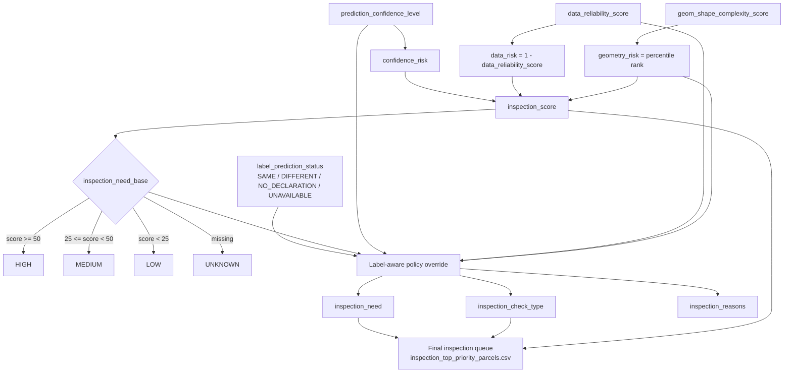
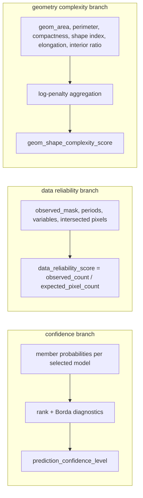

# Inspection Priority Decision Table

This page summarizes how inspection priority is computed in the ML classification pipeline.

## Visual maps (how values flow)

### A) End-to-end inspection-priority flow



### B) Score calculation map

```mermaid
flowchart LR
  CR[confidence_risk] --> S
  DR[data_risk] --> S
  GR[geometry_risk] --> S
  S[inspection_score = 100 *\n(0.60*confidence_risk + 0.25*data_risk + 0.15*geometry_risk)\nclip to [0,100], round 2]
```

### C) Final-need decision map (policy layer)

```mermaid
flowchart TD
  A[label_prediction_status] --> B{SAME?}
  B -->|Yes| S1{strong evidence\n& geometry good}
  S1 -->|Yes| S2[inspection_need = LOW]
  S1 -->|No| S3[inspection_need = MEDIUM\ncheck_type = INSUFFICIENT_EO_EVIDENCE]

  B -->|No| C{DIFFERENT?}
  C -->|Yes| D1{sufficient evidence?}
  D1 -->|Yes + geometry good| D2[VERY_HIGH + DECLARATION_CONFLICT]
  D1 -->|Yes + geometry not good| D3[HIGH + DECLARATION_CONFLICT]
  D1 -->|No| D4[MEDIUM_HIGH or MEDIUM_UNCERTAIN\n+ INSUFFICIENT_EO_EVIDENCE]

  C -->|No| E{NO_DECLARATION?}
  E -->|Yes| E1[keep inspection_need_base\nif need != LOW -> INSUFFICIENT_EO_EVIDENCE]
  E -->|No (UNAVAILABLE)| E2[UNKNOWN + INSUFFICIENT_EO_EVIDENCE]
```

## How the 3 key inputs are calculated

### Quick dependency graph for the 3 inputs



### 1) `prediction_confidence_level` (from Step 5 prediction)

The confidence level is rank-based and is computed from selected ensemble member probabilities for the **final predicted class**.

1. Convert each model's class probabilities to descending ranks per parcel.
2. Convert ranks to Borda scores in `[0, 100]`:

  `borda = 100 * (n_classes - rank) / (n_classes - 1)`

3. For the final predicted class, compute diagnostics across models:
  - `prediction_mean_borda`
  - `prediction_rank_range`
  - agreement with Borda winner
  - tie flag on Borda winner
4. Assign rank confidence:
  - `HIGH` if
    - Borda winner agrees with final prediction,
    - no winner tie,
    - `prediction_mean_borda >= 90`,
    - `prediction_rank_range <= 2`,
    - enough models (`minimum_models`, default 3)
  - `MEDIUM` if same guards hold and:
    - `prediction_mean_borda >= 75`,
    - `prediction_rank_range <= 4`
  - otherwise `LOW`

If class-reliability guard is enabled, the final `prediction_confidence_level` is the lower of:
- rank confidence level, and
- predicted-class OOF precision reliability level (`HIGH`/`MEDIUM`/`LOW`).

Defaults for class reliability:
- `HIGH` if OOF support >= 100 and precision >= 0.80
- `MEDIUM` if OOF support >= 100 and precision >= 0.60
- else `LOW`

### 2) `data_reliability_score` (from parcel zonal-stat extraction)

This score measures how much of the parcel time-series comes from **original observed pixels** (not filled values).

- `expected_pixel_count = intersected_pixel_count * n_periods * n_variables`
- `observed_count = number of finite pixels in observed_mask`
- `data_reliability_score = observed_count / expected_pixel_count`

Also reported for diagnostics:
- `temporal_filled_ratio = temporal_filled_pixel_count / expected_pixel_count`
- `spatial_filled_ratio = spatial_filled_pixel_count / expected_pixel_count`

### 3) `geom_shape_complexity_score` (from parcel geometry metrics)

This score combines raster/geometry mismatch, boundary irregularity, and elongation using log penalties.

Base geometry metrics:
- `geom_interior_area_ratio = pixel_area / geom_area`
- `geom_compactness = 4πA / P²`
- `geom_perimeter_area_ratio = P / A`
- `geom_shape_index = P / (2*sqrt(πA))`
- `geom_elongation = long_side / short_side` of the minimum rotated rectangle

Penalties:
- `raster_agreement_penalty = |log(geom_interior_area_ratio)|`
- `compactness_penalty = max(0, -0.5*log(geom_compactness))`
- `normalized_perimeter_area_ratio = geom_perimeter_area_ratio / (2*sqrt(π/geom_area))`
- `perimeter_penalty = max(0, log(normalized_perimeter_area_ratio))`
- `shape_index_penalty = max(0, log(geom_shape_index))`
- `elongation_penalty = max(0, log(geom_elongation))`

Then:
- `boundary_penalty = mean(compactness_penalty, perimeter_penalty, shape_index_penalty)`
- `geom_shape_complexity_score = mean(raster_agreement_penalty, boundary_penalty, elongation_penalty)`

Higher values indicate more complex/irregular parcel geometry.

## One-page decision table

| Step | What is computed | Rule / Formula | Output field(s) | Meaning |
|---|---|---|---|---|
| 1 | Validate required inputs | Must exist: `prediction_confidence_level`, `data_reliability_score`, `geom_shape_complexity_score` | (gate) | If missing, inspection scoring is not produced. |
| 2 | Model-confidence risk | Map confidence to risk: HIGH -> 0.0, MEDIUM -> 0.5, LOW -> 1.0 | `confidence_risk` | Higher value means lower model trust. |
| 3 | EO-data risk | `data_risk = 1 - data_reliability_score` | `data_risk` | Higher value means weaker EO evidence quality. |
| 4 | Geometry risk | Percentile rank of `geom_shape_complexity_score` within prediction set | `geometry_risk` | Higher value means more complex geometry. |
| 5 | Composite inspection score | `inspection_score = 100 * (0.60*confidence_risk + 0.25*data_risk + 0.15*geometry_risk)`, clipped to [0, 100], rounded to 2 decimals | `inspection_score` | Continuous risk intensity (0 low risk, 100 high risk). |
| 6 | Base need (score only) | HIGH if score >= 50; MEDIUM if score >= 25 and < 50; LOW if < 25; UNKNOWN if score missing | `inspection_need_base` | Priority before declaration/prediction policy overrides. |
| 7 | Declaration-vs-prediction status | Compare normalized declared and predicted labels -> `SAME`, `DIFFERENT`, `NO_DECLARATION`, `UNAVAILABLE` | `label_prediction_status` | Label context for operational policy. |
| 8 | Evidence sufficiency | `evidence_is_sufficient` when score is valid AND confidence=HIGH AND data reliability >= 0.80 AND geometry risk present | (internal rule) | Controls whether disagreement becomes conflict or uncertainty. |
| 9 | Final need + check type | Policy override by status: SAME, DIFFERENT, NO_DECLARATION, UNAVAILABLE (details below) | `inspection_need`, `inspection_check_type` | Final operational categorization. |
| 10 | Explainability reasons | Add stable reason tags from confidence/data/geometry/declaration logic | `inspection_reasons` | Per-parcel audit trail. |
| 11 | Final inspection list | Keep rows with `inspection_check_type != NONE`; sort by need rank then by score desc | `inspection_top_priority_parcels.csv` | Actionable queue for field/desk inspection. |

## Step 9 policy details (final operational override)

### When `label_prediction_status = SAME`
- If evidence is sufficient and geometry is good (`geometry_risk < 0.50`) -> `inspection_need = LOW`
- Otherwise (valid score) -> `inspection_need = MEDIUM`
- If score invalid -> `inspection_need = UNKNOWN`
- Non-strong cases are flagged as `inspection_check_type = INSUFFICIENT_EO_EVIDENCE`

### When `label_prediction_status = DIFFERENT`
- Sufficient evidence + good geometry -> `inspection_need = VERY_HIGH`, `inspection_check_type = DECLARATION_CONFLICT`
- Sufficient evidence + not-good geometry -> `inspection_need = HIGH`, `inspection_check_type = DECLARATION_CONFLICT`
- Insufficient evidence + low confidence + low data reliability + complex geometry -> `inspection_need = MEDIUM_UNCERTAIN`, `inspection_check_type = INSUFFICIENT_EO_EVIDENCE`
- Other insufficient-evidence disagreements -> `inspection_need = MEDIUM_HIGH`, `inspection_check_type = INSUFFICIENT_EO_EVIDENCE`
- Invalid score -> `inspection_need = UNKNOWN`

### When `label_prediction_status = NO_DECLARATION`
- Keep `inspection_need_base`
- If final need is not LOW -> `inspection_check_type = INSUFFICIENT_EO_EVIDENCE`

### When `label_prediction_status = UNAVAILABLE`
- Force `inspection_need = UNKNOWN`
- Force `inspection_check_type = INSUFFICIENT_EO_EVIDENCE`

## Interpretation guide

- `inspection_score`: continuous risk intensity.
- `inspection_need`: final priority class used by operations.
- `inspection_check_type`:
  - `DECLARATION_CONFLICT`: reliable declaration/prediction mismatch.
  - `INSUFFICIENT_EO_EVIDENCE`: confidence/data/geometry not strong enough.
  - `NONE`: no operational check requested.

## Final queue ordering

Priority rank used to build the final list:
1. `VERY_HIGH`
2. `HIGH`
3. `MEDIUM_HIGH`
4. `MEDIUM_UNCERTAIN`
5. `MEDIUM`
6. `LOW`
7. `UNKNOWN`

Within each priority group, parcels are sorted by `inspection_score` descending.
