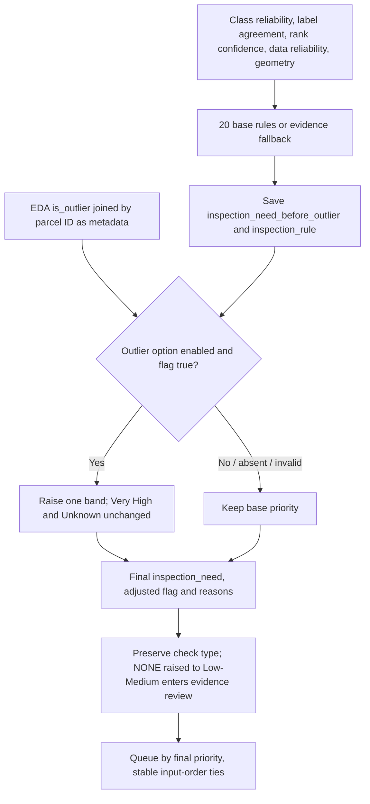

# Inspection Priority Decision Table

Visual reference: [Full analytical workflow](<Full Workflow.png>), including
evidence calculations, validation branches, all 20 base rules, the EDA outlier
adjustment, and final queue ordering.

## Policy and inputs

Step 5 first applies a base rule matrix to five inputs: predicted-class OOF
reliability, declared-versus-predicted label agreement, parcel rank confidence,
data reliability, and geometry risk. The sixth input, EDA `is_outlier`, raises
the base result by one band when `inspection_include_outlier=True` (enabled in
the Neuro workflow; the library default is `False`). It never caps rank confidence with class
reliability. Numeric uncertainty scores do not determine priority or queue order.

The seven ordered priorities are **Very Low, Low, Low–Medium, Medium,
Medium–High, High, Very High**. Medium means inconclusive evidence requiring
verification. Before outlier adjustment, higher bands indicate increasingly
convincing declaration conflicts; lower bands indicate increasingly convincing
agreement. An outlier increase signals additional review priority, not stronger
evidence of a declaration conflict. These are operational
rules, not calibrated probabilities that a declaration is incorrect.

## Base decision table

These rules apply with class reliability enabled and valid inputs. Conditions
within a row use AND. Any means any valid value. The first matching rule wins;
overlapping low-evidence rules always assign Medium. IDs are persisted in
`inspection_rule` so the decision can be traced to this table. The priorities
below are **before** outlier adjustment, recorded in `inspection_need_before_outlier`.

| Rule | Class reliability | Declared vs predicted | Rank confidence | Data reliability | Geometry risk | Base Priority Label |
|---|---|---|---|---|---|---|
| R01 | High | Same | High | > 0.8 | < 0.5 | Very Low |
| R02 | High | Same | High | > 0.8 | >= 0.5 | Low |
| R03 | Medium | Same | High | > 0.8 | < 0.5 | Low |
| R04 | Medium | Same | High | > 0.8 | >= 0.5 | Low–Medium |
| R05 | High | Same | Medium | > 0.8 | < 0.5 | Low–Medium |
| R06 | High | Same | Medium | > 0.8 | >= 0.5 | Medium |
| R07 | Medium | Same | Medium | > 0.8 | Any | Medium |
| R08 | Low | Same | Any | Any | Any | Medium |
| R09 | Any | Same | Low | Any | Any | Medium |
| R10 | Any | Same | Any | <= 0.8 | Any | Medium |
| R11 | High | Different | High | > 0.8 | < 0.5 | Very High |
| R12 | High | Different | High | > 0.8 | >= 0.5 | High |
| R13 | Medium | Different | High | > 0.8 | < 0.5 | High |
| R14 | Medium | Different | High | > 0.8 | >= 0.5 | Medium–High |
| R15 | High | Different | Medium | > 0.8 | < 0.5 | Medium–High |
| R16 | High | Different | Medium | > 0.8 | >= 0.5 | Medium |
| R17 | Medium | Different | Medium | > 0.8 | Any | Medium |
| R18 | Low | Different | Any | Any | Any | Medium |
| R19 | Any | Different | Low | Any | Any | Medium |
| R20 | Any | Different | Any | <= 0.8 | Any | Medium |

The table uses default thresholds. Data reliability must be **strictly greater
than** `inspection_medium_data_reliability_threshold` (default 0.8).
Geometry is favorable only **below** `inspection_medium_geometry_risk_threshold`
(default 0.5). Exactly 0.8 is not high data reliability; exactly 0.5 is in the
less favorable geometry band. These existing configuration settings remain
customizable; the comparison operators do not change.

## Optional EDA outlier adjustment

This is the final policy stage, applied after both the base matrix and its
fallbacks. For example, `NO_DECLARATION` or `CLASS_RELIABILITY_UNAVAILABLE`
produces Medium before adjustment and Medium–High for an enabled true outlier.
Neither case becomes a declaration conflict.


```mermaid
flowchart TD
    Evidence[Class reliability, label agreement, rank confidence, data reliability, geometry] --> Base[20 base rules or evidence fallback]
    EDA[EDA is_outlier joined by parcel ID as metadata] --> Enabled{Outlier option enabled and flag true?}
    Base --> Before[Save inspection_need_before_outlier and inspection_rule]
    Before --> Enabled
    Enabled -->|Yes| Raise[Raise one band; Very High and Unknown unchanged]
    Enabled -->|No / absent / invalid| Keep[Keep base priority]
    Raise --> Audit[Final inspection_need, adjusted flag and reasons]
    Keep --> Audit
    Audit --> Queue[Preserve check type; NONE raised to Low-Medium enters evidence review]
    Queue --> Sort[Queue by final priority, stable input-order ties]
```

Set `inspection_include_outlier=True` in `ClassificationPipelineConfig` to apply
`is_outlier` after the matrix. The default is `False`. Supply the Boolean EDA
flag as metadata in the input table, joined by parcel ID; keep it out of
`feature_columns`. Equivalent numeric 0/1 flags are accepted; strings are not.

| Matrix priority | Final priority when enabled and `is_outlier=True` |
|---|---|
| Very Low | Low |
| Low | Low–Medium |
| Low–Medium | Medium |
| Medium | Medium–High |
| Medium–High | High |
| High | Very High |
| Very High | Very High |
| Unknown | Unknown |

False, missing, invalid, or absent flags leave the original matrix priority
unchanged. This option never changes predictions, confidence, or the numeric
inspection score. Outlier escalation alone does not establish a declaration
conflict: the existing check type is preserved, except a previously `NONE`
row raised to Low–Medium enters `INSUFFICIENT_EO_EVIDENCE` review.

`inspection_rule` retains the original matrix rule. The output records
`inspection_need_before_outlier`, `inspection_outlier_adjusted`, and reason
`OUTLIER_PRIORITY_INCREASE` when a band actually increases. Very High and Unknown
are not marked adjusted. The queue sorts on final priority using existing stable
ties. Recalculation reapplies the matrix first, so increases never accumulate.
The report and queue include the source flag and adjustment fields.

The report exports `inspection_outlier_priority_transitions.csv` under `data/`
and a matching PNG under `plots/`. Rows show saved base priority, columns show
final priority, and cells count parcels. Diagonal cells are unchanged, including
capped Very High and unscored Unknown. The chart is unavailable for older runs
without saved base priorities; reports never reconstruct decisions from live
configuration. All operational plots use final priority. Score-only plots are
explicitly unaffected by `is_outlier`.

The prediction summary records the enabled switch, whether the column exists,
and the adjusted row count. Existing runs need `is_outlier` already present in
saved predictions for `recalculate_prediction_quality()` to use it; changing
configuration alone cannot add EDA metadata to an older run.

## Disabled and unavailable inputs

- When class reliability is disabled, omit its condition: High rank + high data
  produces Very Low/Very High for Same/Different with favorable geometry and
  Low/High otherwise. Medium rank + high data + favorable geometry produces
  Low–Medium/Medium–High; other valid comparable cases produce Medium. The
  corresponding R01/R02/R05/R06/R09/R10 or R11/R12/R15/R16/R19/R20 identifiers
  are used with `inspection_class_reliability_applied=False`. Class evidence
  is retained unchanged, never relabeled High.
- Enabled reliability that is missing, unrecognized, or invalid due to
  insufficient OOF support produces Medium with
  `inspection_rule=CLASS_RELIABILITY_UNAVAILABLE`. It does not invalidate rank
  confidence. This differs from measured Low reliability in R08/R18.
- A missing declaration with valid prediction evidence produces Medium and
  `inspection_rule=NO_DECLARATION`. No conflict is inferred.
- Missing predictions, invalid/missing rank levels, explicitly invalid rank
  evidence, invalid data reliability (outside [0, 1]), or missing/negative/
  nonfinite geometry complexity produce `UNKNOWN` with
  `inspection_rule=REQUIRED_EVIDENCE_UNAVAILABLE`. Unknown is an unscored status,
  outside the seven priority bands.
- Entirely missing required confidence/data/geometry source columns skip the
  inspection layer with a warning and missing-column metadata.

## Confidence and class evidence

Rank confidence remains HIGH/MEDIUM/LOW from Borda agreement, mean Borda,
rank range, ties, and the minimum model count. Class reliability never changes
its level, validity, reason, or confidence-only review flag. See the
[confidence methodology](rank_based_ensemble_confidence_methodology.md).

Class reliability is learned only from training OOF predictions of the selected
strategy, using the predicted class's precision and predicted-class support:

| Class reliability | Default rule |
|---|---|
| HIGH | Support >= 100 and precision >= 0.80 |
| MEDIUM | Support >= 100 and precision >= 0.60 but < 0.80 |
| LOW, valid | Support >= 100 and precision < 0.60 |
| LOW, invalid | Support < 100; use the unavailable-evidence fallback |

Step 4 freezes this table and its enabled flag. Step 5 propagates the frozen
flag as `inspection_class_reliability_enabled`, overriding live configuration.
Direct dataframe scoring without this field uses `config.class_reliability_enabled`.

## Geometry and observation evidence

### 2) `data_reliability_score` (from parcel zonal-stat extraction)

This score measures how much of the parcel time-series comes from **original observed pixels** (not filled values).

- `expected_pixel_count = intersected_pixel_count * n_periods * n_variables`
- `observed_count = number of finite pixels in observed_mask`
- `data_reliability_score = observed_count / expected_pixel_count`

Also reported for diagnostics:
- `temporal_filled_ratio = temporal_filled_pixel_count / expected_pixel_count`
- `spatial_filled_ratio = spatial_filled_pixel_count / expected_pixel_count`

### 3) `geom_shape_complexity_score` (from parcel geometry metrics)

This score combines raster/geometry mismatch, boundary irregularity, and elongation using log penalties.

Base geometry metrics:
- `geom_interior_area_ratio = pixel_area / geom_area`
- `geom_compactness = 4πA / P²`
- `geom_perimeter_area_ratio = P / A`
- `geom_shape_index = P / (2*sqrt(πA))`
- `geom_elongation = long_side / short_side` of the minimum rotated rectangle

Penalties:
- `raster_agreement_penalty = |log(geom_interior_area_ratio)|`
- `compactness_penalty = max(0, -0.5*log(geom_compactness))`
- `normalized_perimeter_area_ratio = geom_perimeter_area_ratio / (2*sqrt(π/geom_area))`
- `perimeter_penalty = max(0, log(normalized_perimeter_area_ratio))`
- `shape_index_penalty = max(0, log(geom_shape_index))`
- `elongation_penalty = max(0, log(geom_elongation))`

Then:
- `boundary_penalty = mean(compactness_penalty, perimeter_penalty, shape_index_penalty)`
- `geom_shape_complexity_score = mean(raster_agreement_penalty, boundary_penalty, elongation_penalty)`

Higher values indicate more complex/irregular parcel geometry.

## Outputs and diagnostic score

- `inspection_need`: machine-readable priority (`VERY_LOW`, `LOW`, `LOW_MEDIUM`,
  `MEDIUM`, `MEDIUM_HIGH`, `HIGH`, `VERY_HIGH`) or unscored `UNKNOWN`.
- `inspection_priority_label`: readable final label after optional outlier adjustment.
- `inspection_rule`: first matching rule ID or explicit fallback identifier.
- `inspection_class_reliability_applied`: whether valid enabled class evidence
  participated in a comparable, valid policy decision.
- `inspection_need_before_outlier`: base matrix or fallback priority.
- `inspection_outlier_adjusted`: True only when the outlier stage increased priority.
- `inspection_check_type`: `NONE` for Very Low/Low; `DECLARATION_CONFLICT` for
  Different labels with Medium–High/High/Very High; `INSUFFICIENT_EO_EVIDENCE`
  for remaining base cases. After outlier adjustment, preserve this type except
  NONE raised to Low–Medium becomes `INSUFFICIENT_EO_EVIDENCE`. The last name is retained for compatibility and includes
  model/class uncertainty and missing evidence as well as EO quality issues.
- `inspection_reasons`: pipe-separated diagnostic reasons, including
  MEDIUM/LOW_CLASS_RELIABILITY, unavailable reliability, and missing declarations.

The former `MEDIUM_UNCERTAIN` category is replaced by Medium with explicit reasons.

For continuity, the numeric score and score-only base category remain diagnostics:

```text
confidence_risk = HIGH: 0.0, MEDIUM: 0.5, LOW: 1.0
inspection_score = 100 * (0.60*confidence_risk
                        + 0.25*(1 - data_reliability_score)
                        + 0.15*geometry_risk)
inspection_need_base = HIGH if score >= 50, MEDIUM if >= 25, otherwise LOW
```

Weights and score thresholds affect only these diagnostic fields. Neither the
score nor `inspection_need_base` enters any inspection-priority rule.

The inspection queue includes `inspection_check_type != NONE`, ordered Very
High, High, Medium–High, Medium, Low–Medium, Low, Very Low, then Unknown. Ties
preserve input order; diagnostic scores do not break ties. Exported queue rows
include the class evidence, readable label, matched rule, and reasons.

## Updating existing runs

Existing outputs remain unchanged until recalculated. With saved member
probabilities and a supported frozen OOF contract, call
`pipeline.recalculate_prediction_quality()` to apply rank-only confidence and
these rules without retraining. Legacy guard contracts are read as independent
class evidence under the new policy; they no longer cap confidence. Rerun Step 4
first to refresh evaluation confidence artifacts and write the version 3 contract,
or to change the frozen class-reliability flag. Obsolete class x Top-1 contracts
still require Step 4. Recreating HTML reports alone does not recalculate outputs.
